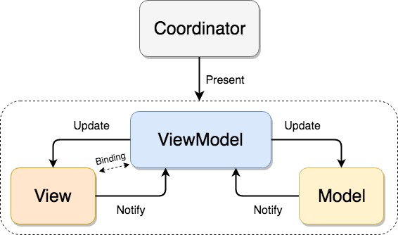

# Finding-Falcone

## Setup
Install cocoapods to manage dependencies.

```
sudo gem install cocoapods
```

Install dependencies for the App.

```
pod install
```

## Design pattern

Using MVVMC. Coordinator is used for managing the routing. RXSwift and RXCocoa is used in place of delegates for data bindings. 



